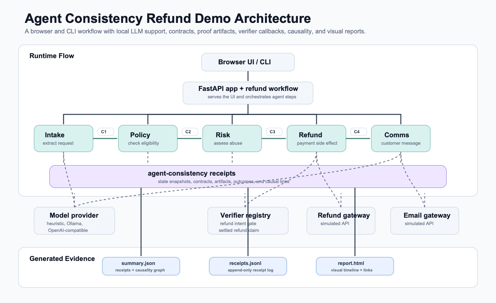
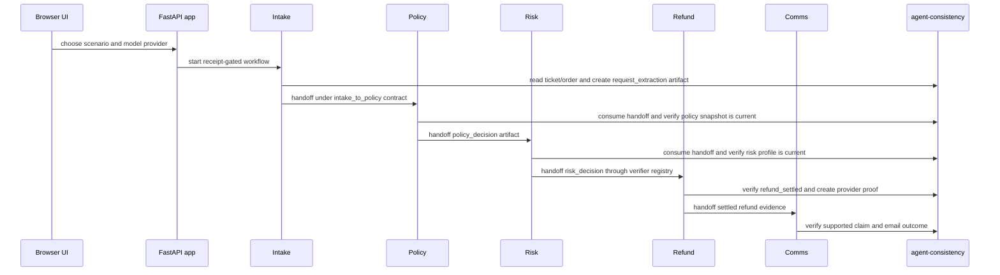
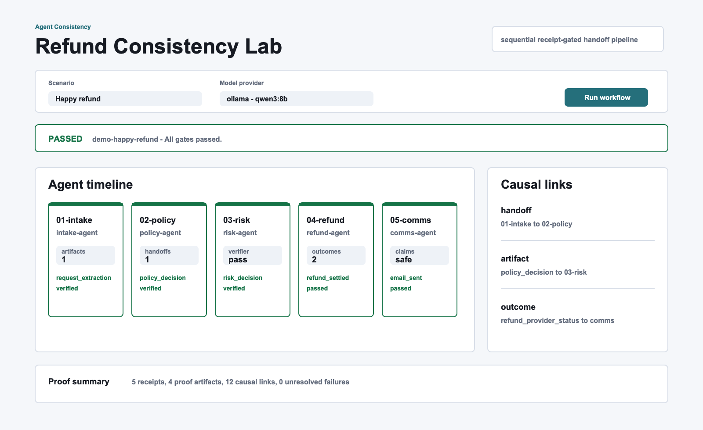
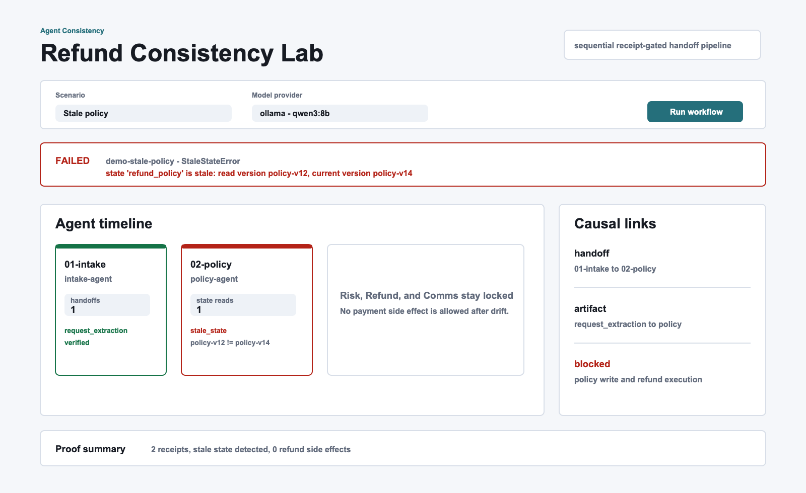

# Agent Consistency Refund Demo

A compact proof project showing how `agent-consistency` catches stale-state,
broken-handoff, and false-success bugs in a real multi-agent refund workflow.

## Domain Context

This demo is set in refund operations for an e-commerce or support platform.
That domain is useful because everyone understands the business goal: a
customer asks for a refund, the company decides whether it is allowed, money may
move, and the customer gets a response.

It is also risky enough to be real. A refund workflow touches customer trust,
policy compliance, abuse prevention, payment side effects, and customer
communication. A system can look green while still doing the wrong thing.

## The Problem

Multi-agent workflows do not only fail because an agent calls a dangerous tool.
They often fail because each agent is working from a slightly different version
of reality.

In a refund workflow, that can look like this:

- the policy agent approves using an old policy version
- the intake agent omits previous refund history
- the refund agent retries a payment action with weak idempotency
- the payment provider returns `pending`, but the workflow tells the customer
  the refund is complete
- debugging is hard because nobody knows which state each agent saw

Those are quietly wrong successes. Logs may say every step ran, dashboards may
show `200 OK`, and still the business outcome may be wrong.

## What Is `agent-consistency`?

`agent-consistency` is a small Python library for adding consistency receipts to
agent workflows. It is not an agent framework, policy engine, tracing dashboard,
or model gateway.

It answers one operational question:

> Did this agent act on the right state, pass the right context, and prove the
> claimed outcome became true?

The library records:

- state snapshots read by each agent
- assumptions made by each step
- handoff contracts with required inputs and evidence
- handoff packets passed between agents
- proof artifacts produced by model calls, decisions, and provider reads
- state deltas produced by decisions and side effects
- outcome checks that prove the business result actually happened
- causal links showing which receipt consumed which handoff or artifact

This gives developers a lightweight way to catch stale state, incomplete
handoffs, and false success before those errors reach production.

## How This Demo Uses It

This repo builds a five-agent refund workflow and wraps every important step
with `agent-consistency`. It can run as a CLI proof or as a browser-based demo
backed by a local Ollama model.

The app uses the published PyPI package:

```bash
python -m pip install -r requirements.txt
```

It is pinned to `agent-consistency==0.2.0`, which adds handoff contracts, proof
artifacts, verifier callbacks, and a causality graph.

For development and tests:

```bash
python -m pip install -r requirements-dev.txt
```

The demo intentionally includes one successful scenario and three broken
scenarios:

- happy path: all five agents complete and produce consistency receipts
- `StaleStateError`: policy v12 was read but v14 is current
- `HandoffValidationError`: previous refund count was missing
- `OutcomeVerificationError`: refund status is pending, not settled

That gives a quick proof that the library works in practice, not just in a unit
test.

## Why Multi-Agent

This workflow uses multiple agents because the responsibilities are naturally
different:

- support intake needs to understand the customer request
- policy eligibility is a business-rules task
- risk assessment is a fraud/abuse task
- refund execution is a side-effecting payment task
- customer communication must not make unsupported claims

One giant agent could do all of this, but it would hide ownership boundaries.
This demo keeps the boundaries visible and checks the handoff between them.

## Orchestration Pattern

**Pattern: sequential receipt-gated handoff pipeline.**

The workflow deliberately uses a simple sequential orchestration pattern:

```text
Intake -> Policy -> Risk -> Refund -> Comms
```

Each agent can continue only after the previous agent produces a valid handoff
packet. The handoff is checked against a contract, attached proof artifacts,
state versions, verifier callbacks, and outcome checks. This keeps the demo easy
to follow while still modeling a real production concern: every agent must prove
it is operating on the right version of reality before the next agent acts.

## What This Repo Proves

After running the demo, you should be able to see:

- where each agent step starts and ends
- what state version each agent read
- what facts were handed to the next agent
- which proof artifact justified a handoff
- which verifier accepted or rejected a contract
- how each downstream step links back to upstream receipts
- why a stale policy is blocked before payment execution
- why a missing handoff field cannot silently pass downstream
- why a payment provider response is not accepted until the refund is settled

The point is not only that the workflow runs. The point is that the workflow can
explain why it was allowed to continue, or why it stopped.

## Consistency Features Shown

This demo exercises the newer consistency layer directly:

- **Handoff contracts** declare required facts, required evidence, produced
  artifacts, and optional verifier names.
- **Proof artifacts** attach model output, policy decisions, risk decisions, and
  refund provider status to receipts.
- **Dynamic verifiers** run small app-owned checks such as "is this refund intent
  allowed?" or "is this customer message backed by a settled refund?"
- **Causality graph** links receipts through consumed handoffs and artifacts, so
  the workflow is explainable after the run.
- **HTML report** turns the receipts and causal links into a quick visual
  inspection page.

## Architecture



## Process Flow



## Agent Roles

| Agent | Responsibility | Consistency check |
| --- | --- | --- |
| Intake Agent | Extract refund request and order facts | Required handoff facts, evidence, and request extraction artifact |
| Policy Agent | Decide policy eligibility | Contract consumption, stale policy detection, and policy decision artifact |
| Risk Agent | Check refund abuse risk | Contract consumption, stale risk detection, and risk decision artifact |
| Refund Agent | Issue payment side effect | Dynamic verifier, settled-refund outcome, and provider proof artifact |
| Comms Agent | Notify customer | Contract consumption, supported-claim check, and email outcome |

## Quickstart: CLI

```bash
git clone https://github.com/karimbaidar/agent-consistency-refund-demo.git
cd agent-consistency-refund-demo

python -m venv .venv
source .venv/bin/activate
python -m pip install -U pip
python -m pip install -r requirements-dev.txt
python -m pip show agent-consistency
python -m pip show agent-consistency-refund-demo

python -m refund_demo.cli --input samples/inputs/happy_path.json
```

`python -m pip show agent-consistency` should show the installed PyPI package,
currently pinned to `0.2.0`.
`python -m pip show agent-consistency-refund-demo` confirms the local demo app
is installed in editable mode, which is also how CI imports `refund_demo`.

Expected console output:

```text
Workflow result: PASSED
Run id: demo-happy-refund
Provider: heuristic
Receipts: 5
Report: runs/demo-happy-refund/summary.json
HTML report: runs/demo-happy-refund/report.html
Receipt log: runs/demo-happy-refund/receipts.jsonl
Customer message id: email_c1d35b34d91dd0dd
```

## Quickstart: Visual App

Run the browser demo locally with the deterministic provider:

```bash
python -m pip install -r requirements-dev.txt
MODEL_PROVIDER=heuristic python -m uvicorn refund_demo.web:app --reload
```

Open:

```text
http://localhost:8000
```

The app lets you choose a scenario, choose a provider, run the workflow, and see
the agent timeline, handoff contracts, proof artifacts, verifier outcomes, and
causal links on screen.

## Docker: Local LLM Demo

The Docker setup runs the app with Ollama and defaults to `qwen3:8b`, a strong
free local model option.

Start Ollama:

```bash
docker compose up -d ollama
```

Pull the model into the Docker volume:

```bash
docker compose run --rm model-pull
```

Start the visual app:

```bash
docker compose up --build app
```

Open:

```text
http://localhost:8000
```

To use a smaller model on limited hardware:

```bash
OLLAMA_MODEL=qwen3:4b docker compose run --rm model-pull
OLLAMA_MODEL=qwen3:4b docker compose up --build app
```

The generated proof files are:

```text
runs/demo-happy-refund/summary.json
runs/demo-happy-refund/report.html
runs/demo-happy-refund/receipts.jsonl
```

Inspect the receipt summary:

```bash
python -m json.tool runs/demo-happy-refund/summary.json
```

If you have `jq`:

```bash
jq '.receipts[] | {step_id, agent, status, artifacts: .proof_artifacts, consumed_handoff_ids, outcomes}' \
  runs/demo-happy-refund/summary.json
```

## Visual Report

Each run writes a static HTML report beside the JSON summary. It shows a receipt
timeline, consumed handoffs, proof artifact names, outcome checks, and the
causal links between steps.

```bash
open runs/demo-happy-refund/report.html
```

The report is intentionally plain HTML, so it works without a dev server,
database, or frontend build step. That keeps the proof easy to run while still
making the value visible.

## Demo Screenshots

Demo 1 shows the passing refund workflow with five receipts, verified artifacts,
and causal links between the agent handoffs.



Demo 2 shows the stale-policy failure. The workflow stops before refund
execution because the policy agent read `policy-v12` while the current policy is
`policy-v14`.



## Validation Matrix

Run all four scenarios:

```bash
python -m refund_demo.cli --input samples/inputs/happy_path.json
python -m refund_demo.cli --input samples/inputs/stale_policy.json || true
python -m refund_demo.cli --input samples/inputs/missing_handoff.json || true
python -m refund_demo.cli --input samples/inputs/pending_refund.json || true
```

The three failure scenarios intentionally return exit code `1`, because the
library correctly stops the workflow. The `|| true` keeps a shell script moving
while still printing the failure.

Expected validation results:

| Scenario | Expected result | What it proves |
| --- | --- | --- |
| `happy_path.json` | `PASSED` with 5 receipts | all five agents completed consistently |
| `stale_policy.json` | `FAILED` with `StaleStateError` | stale state is detected before refund execution |
| `missing_handoff.json` | `FAILED` with `HandoffValidationError` | required handoff context cannot be silently omitted |
| `pending_refund.json` | `FAILED` with `OutcomeVerificationError` | tool success is not accepted until the business outcome is true |

## Failure Demos

Stale policy:

```bash
python -m refund_demo.cli --input samples/inputs/stale_policy.json
```

Expected result:

```text
Workflow result: FAILED
Run id: demo-stale-policy
Provider: heuristic
Receipts: 2
Report: runs/demo-stale-policy/summary.json
HTML report: runs/demo-stale-policy/report.html
Receipt log: runs/demo-stale-policy/receipts.jsonl
Failure: StaleStateError: state 'refund_policy' is stale: read version policy-v12, current version policy-v14
```

Missing handoff field:

```bash
python -m refund_demo.cli --input samples/inputs/missing_handoff.json
```

Expected result:

```text
Workflow result: FAILED
Run id: demo-missing-handoff
Provider: heuristic
Receipts: 1
Report: runs/demo-missing-handoff/summary.json
HTML report: runs/demo-missing-handoff/report.html
Receipt log: runs/demo-missing-handoff/receipts.jsonl
Failure: HandoffValidationError: required fact 'order.previous_refund_count' is missing
```

Pending refund:

```bash
python -m refund_demo.cli --input samples/inputs/pending_refund.json
```

Expected result:

```text
Workflow result: FAILED
Run id: demo-pending-refund
Provider: heuristic
Receipts: 4
Report: runs/demo-pending-refund/summary.json
HTML report: runs/demo-pending-refund/report.html
Receipt log: runs/demo-pending-refund/receipts.jsonl
Failure: OutcomeVerificationError: outcome 'refund_settled' failed: refund status is pending, not settled
```

Each scenario writes its own report:

```text
runs/demo-happy-refund/summary.json
runs/demo-happy-refund/report.html
runs/demo-stale-policy/summary.json
runs/demo-stale-policy/report.html
runs/demo-missing-handoff/summary.json
runs/demo-missing-handoff/report.html
runs/demo-pending-refund/summary.json
runs/demo-pending-refund/report.html
```

## Did This Use A Model?

Yes, the app uses a model/provider layer, but the default validation run uses
the built-in `heuristic` provider. That provider is deterministic, local, free,
and does not call an external LLM. This keeps the demo reproducible for CI,
conference talks, README validation, and first-time users with no API keys.

The provider is called in two places:

- `IntakeAgent` calls `provider.complete(..., json_mode=True)` to extract a
  compact refund-request object from the customer ticket and order record.
- `CommsAgent` calls `provider.complete(...)` to draft a short customer message
  after the refund is settled.

Policy, risk, and refund execution are deterministic business logic on purpose.
Those decisions should be auditable and receipt-backed; the model helps with
language-shaped tasks, not payment authority.

The default run prints:

```text
Provider: heuristic
```

That means no external model was used. To use a real model, set
`MODEL_PROVIDER` to `ollama` or `openai-compatible`.

## Provider And Model Setup

The default provider is `heuristic`, which is local, deterministic, free, and
works without API keys.

```bash
MODEL_PROVIDER=heuristic \
python -m refund_demo.cli --input samples/inputs/happy_path.json
```

Use Ollama:

```bash
MODEL_PROVIDER=ollama \
OLLAMA_BASE_URL=http://localhost:11434 \
OLLAMA_MODEL=qwen3:8b \
python -m refund_demo.cli --input samples/inputs/happy_path.json
```

Use an OpenAI-compatible endpoint:

```bash
MODEL_PROVIDER=openai-compatible \
MODEL_BASE_URL=https://api.openai.com/v1 \
MODEL_API_KEY=... \
MODEL_NAME=gpt-4o-mini \
python -m refund_demo.cli --input samples/inputs/happy_path.json
```

The OpenAI-compatible provider can also point at enterprise gateways, Azure
OpenAI-compatible proxies, LiteLLM, vLLM, Together, Groq-compatible proxies, or
internal model platforms.

Copy `.env.example` to `.env` for local configuration:

```bash
cp .env.example .env
```

## Tests

```bash
python -m pytest
ruff check refund_demo tests
```

The tests cover:

- provider configuration
- FastAPI app and browser-entry route
- Docker/Ollama setup files
- happy-path workflow
- stale policy failure
- missing handoff failure
- pending refund false-success failure
- CLI smoke tests
- causality graph and HTML report generation

## Sample Inputs And Outputs

Inputs:

- `samples/inputs/happy_path.json`
- `samples/inputs/stale_policy.json`
- `samples/inputs/missing_handoff.json`
- `samples/inputs/pending_refund.json`

Expected console snippets:

- `samples/expected/happy_path_console.txt`
- `samples/expected/stale_policy_console.txt`
- `samples/expected/missing_handoff_console.txt`
- `samples/expected/pending_refund_console.txt`

Runtime reports are written under `runs/<run-id>/` and intentionally ignored by
Git.

## Extension Ideas

- Add streaming step events so the UI updates while agents run
- Add an optional n8n workflow that calls this app as a consistency-backed node
- Add LangGraph or CrewAI wrappers around the same agents
- Replace gateway simulators with Stripe, Adyen, Zendesk, or ServiceNow sandboxes
- Store receipts in Postgres, Azure Table Storage, or Blob Storage
- Add an Azure Durable Functions version of the workflow
- Emit OpenTelemetry spans with receipt IDs attached

## Contribution Guidance

Good contributions should keep the workflow easy to understand. Prefer small
changes that make the value of consistency receipts clearer.

Before opening a pull request:

1. Add tests for changed behavior.
2. Keep the default `heuristic` provider working without external services.
3. Keep provider-specific logic inside `refund_demo/providers.py`.
4. Run `pytest` and `ruff check refund_demo tests`.
5. Update this README when user-facing behavior changes.

## Positioning

This demo makes a complex operational idea simple:

> Multi-agent apps do not only need safer actions. They need agents to act on
> the same version of reality and prove the claimed outcome became true.

That is the exact gap `agent-consistency` is designed to fill.

## License

MIT.
